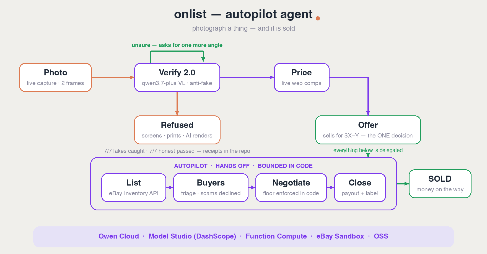

# onlist-agent.

**Photograph a thing — and it's sold. The agent shows you the range it will
sell for; one tap delegates the rest: it lists, negotiates inside your range,
closes the deal — and the prepaid shipping label lands in your email.**
Powered by Qwen on Alibaba Cloud.

Selling second-hand dies in the boring middle: what is it worth, writing the
listing, the inbox full of scammers and lowballs. onlist-agent is an autopilot
for that whole middle — one capture in, a live listing with screened buyers
out. And because an autopilot is only as good as what it lets through, it
refuses to fly anything it can't prove is a **real physical object** (more on
that gate below).

## Try it in 60 seconds (no setup)

**Live on Alibaba Function Compute: https://agent.onlist.ai**

1. Open it **on your phone** (on desktop you'll get a QR code — scan it).
2. Photograph any object near you, two angles. The agent verifies it's real,
   sizes the market, and makes you an offer: **"this sells for $X–Y"**.
3. Tap *Sell it for me* — your one decision — and watch the autopilot fly:
   listed, buyers screened (scam declined for you, lowball countered inside
   your range), **sold** — and the prepaid shipping label is in your email.
   Your next touch is sticking it on a box.
4. If the agent isn't sure mid-flight it doesn't guess — it tells you exactly
   which extra angle to shoot and re-examines.
5. Now try to fool it: photograph a product photo **on your monitor**.
   The autopilot refuses to fly a fake — blocked, with the reasoning.



## The loop

```
frames from a live capture pass
        │
        ▼
┌─ VERIFY 2.0 ─────────────┐   Qwen3.7-VL examines 2–4 frames: same object,
│ same object? real scene? │   real scene (not a screen/print/AI render),
│ scene continuity? AI?    │   scene continuity between frames, condition.
│         unsure? ─────────┼─► asks for a SPECIFIC extra angle → round 2.
└──────────┬───────────────┘   Confident fake → listing BLOCKED.
           ▼
┌─ OFFER ──────────────────┐   Qwen + forced web search finds live comps →
│ "sells for $X–Y"         │   a sale RANGE. 🧑 One tap authorizes it —
└──────────┬───────────────┘   the only human decision in the flow.
           ▼
┌─ LIST ───────────────────┐   Status flips to selling on the board.
└──────────┬───────────────┘
           ▼
┌─ TRIAGE → CLOSE ─────────┐   Claims ranked, scams declined, lowballs
│ rank · counter · close   │   countered — all inside the authorized range,
└──────────────────────────┘   enforced in code. Deal closes; a prepaid
                               shipping label is emailed to the seller.
```

Every model call is metered into a **cost ledger** (`runs/ledger.json`) —
tokens and dollars per stage, printed after each run.

## Verify 2.0 benchmark — the receipts

The anti-fake claim is measured, not asserted. `bench/` holds a labeled case
suite — including **AI-generated listings produced with qwen-image**, so the
examiner is tested against fakes from its own model family — and a harness
that rewrites this table:

| kind | cases | correct |
|---|---|---|
| ai (qwen-image renders) | 4 | 4/4 |
| catalog re-shot | 1 | 1/1 |
| object mismatch | 1 | 1/1 |

**Fakes caught: 6/6 · Median verdict: 7.4s · $0.022 per suite**
*(honest-capture cases — the false-block half of the story — land with the
photo session in `bench/SHOTLIST.md`; the harness already reports both)*

It didn't start at 6/6: two AI renders initially *passed* at 0.95 confidence.
Bench-driven prompt iteration (synthetic tells, then a scene-continuity rule —
*the viewpoint may change, the world may not*) closed the gap. The suite,
the generator (`bench/make-ai-cases.py`), and per-case verdicts are all in the
repo: `bun run bench` reproduces it with your key.

## Quickstart (≈3 minutes)

**With Bun** (auto-loads `.env`):

```bash
curl -fsSL https://bun.sh/install | bash   # if you don't have bun
bun install
cp .env.example .env         # paste your DASHSCOPE_API_KEY
bun run smoke                # one cheap call — verifies the key
bun run demo                 # full autopilot pass; stops at the price checkpoint [y / your price / n]
bun run demo --yes           # non-interactive (CI): auto-accepts the proposal
bun run bench                # rerun the Verify 2.0 benchmark
```

**With plain Node** (18+, no Bun — same code, compiled):

```bash
npm install && npm run build
node --env-file=.env dist/cli.js smoke
node --env-file=.env dist/server.js       # HTTP service on :8080
```

`bun run serve` / `node dist/server.js` starts the HTTP flavor
(`/verify`, `/price`, `/triage`, `/digest`, the phone-first demo page) — that's
what runs on Alibaba **Function Compute** behind https://agent.onlist.ai.
See [deploy/alibaba.md](deploy/alibaba.md).

## Runs on Alibaba Cloud

- [`src/qwen.ts`](src/qwen.ts) — DashScope intl endpoint (OpenAI-compatible),
  all Qwen model calls, `enable_search` + `forced_search`, cost metering
- [`src/verify.ts`](src/verify.ts) / [`src/price.ts`](src/price.ts) /
  [`src/triage.ts`](src/triage.ts) — the agent stages on Qwen models
- **Function Compute** hosts the service (Singapore, Node.js web function);
  **OSS** stores the optional evidence locker (below); **Model Studio** runs
  every unit of intelligence

## Evidence locker (OSS, optional)

Every verification can write an immutable audit record — the exact frames the
seller submitted plus the full verdict, timestamped — to Alibaba OSS
(`evidence/<id>/`). That's what disputes get settled with. Zero-dependency
OSS client (HMAC-SHA1, node:crypto), enabled by 4 env vars, silently off
without them: see [deploy/alibaba.md](deploy/alibaba.md).

## The housekeeper — an agent on a schedule

`GET /digest` runs a weekly pass over the board: unverified listings (trust
decays), items sitting unsold (price cut?), unanswered claims (buyers walk) →
one short actionable push. Point an FC Timer trigger (or any cron) at it and
the agent works while you don't. Recommendations only — the human owns every
action.

## Live mode — the first production consumer

[onlist](https://www.onlist.ai) — a social network about your things — is
agent-native: accounts pair with an AI ("Sign in with your AI"), agent writes
are audit-logged, and **agents can never create solid items** — only a human
with a camera makes things real. This repo's agent runs against it unchanged:

```bash
TARGET=onlist ONLIST_USER=you ONLIST_TOKEN=... bun run demo <itemId>
```

The commercial product stays closed; this agent uses only its public surface.

## Layout

```
src/qwen.ts        DashScope client (OpenAI-compatible), cost metering, json mode
src/verify.ts      Verify 2.0 — anti-fake gate + agentic decide() policy (unit-tested)
src/price.ts       price agent (live web search, floor for negotiations)
src/triage.ts      buyer triage + code-bounded counter-offers
src/evidence.ts    OSS evidence locker (zero-dep signing, env-gated)
src/digest.ts      weekly housekeeper
src/agent.ts       the autopilot orchestration
src/board/local.ts self-contained demo board (JSON file)
src/board/onlist.ts live adapter to onlist.ai
src/cli.ts         smoke | demo | digest
src/server.ts      HTTP service + phone demo page (runs on FC)
bench/             labeled benchmark: cases, harness, AI-fake generator, RESULTS.md
```

## How we address the judging criteria

- **Technical depth** — a measured anti-fake system (6/6 fakes incl.
  AI-generated, receipts in-repo) with a self-correction loop
  (the examiner acts on its own uncertainty), delegated negotiation bounded in
  code, an immutable OSS audit trail, and a per-stage cost ledger.
- **Innovation** — every "photo→listing" tool trusts the photo. This one
  interrogates it. Proof-of-physical-reality as the gate to commerce.
- **Problem value** — AI-fake listings are the top trust problem of 2026
  marketplaces; verified-only listings attack it at the root.
- **Presentation** — try the live agent at https://agent.onlist.ai; the
  3-minute video shows it catching a screen re-shot, asking for a better
  angle, and selling a real item end-to-end.

## License

MIT
