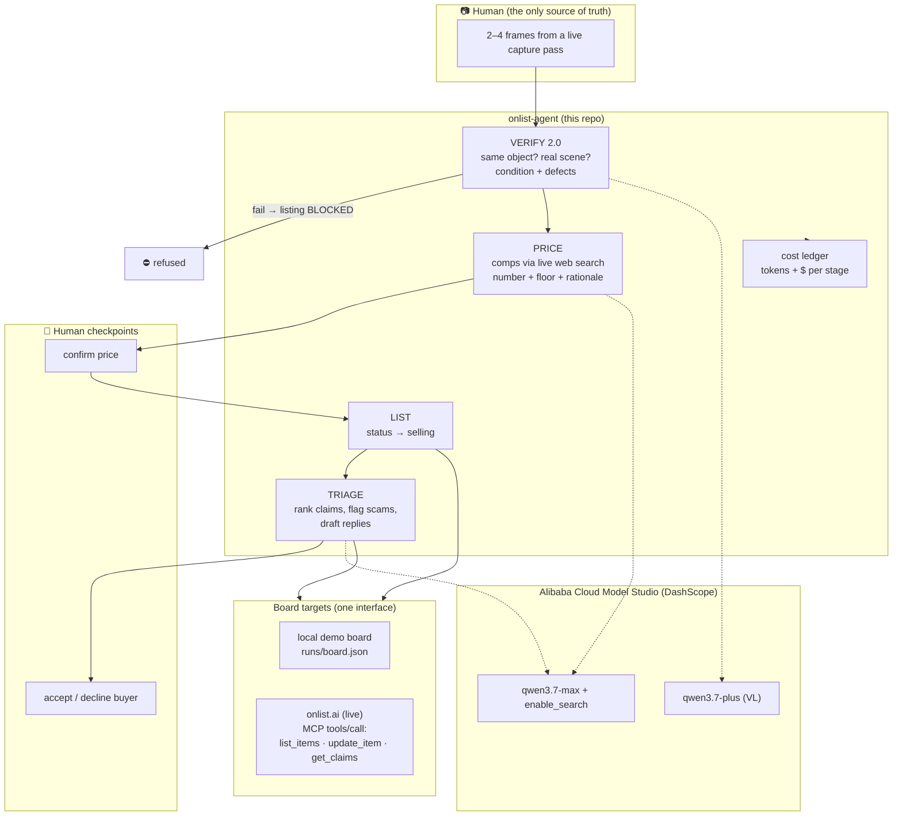

# Architecture

Deployment for judging: `src/server.ts` (endpoints `/verify` `/price` `/triage`)
runs on Alibaba Cloud ECS; the iOS product calls the same endpoints in
production trials. The hard law lives server-side in onlist: **no agent can
create a solid item or touch images** — verification gates commerce, humans
gate money.
